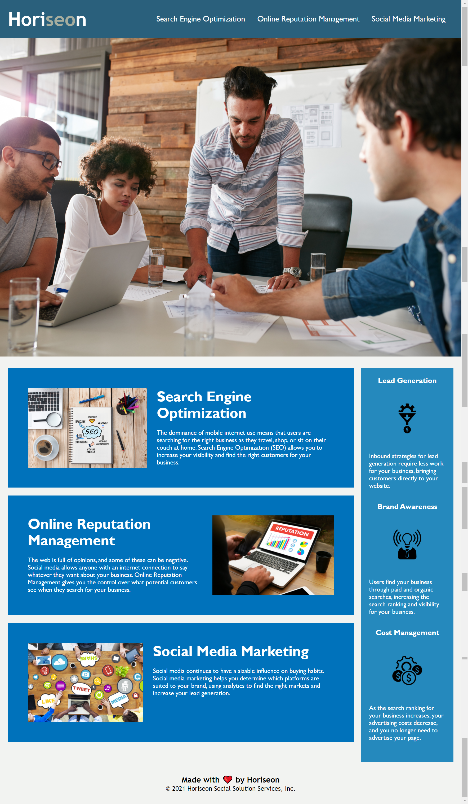

# Code-Refactor-LindaLW

In this Homework assignment, we were asked to:

* refactor the CSS code in order to simplify it and remove duplication. 

* replace generic HTML elements with semantic HTML

* improve the accessibility of the code, and

* fix any bugs that we found.

## Author
- [@LindaWaterhouse](https://www.github.com/llwaterhouse)

## Steps taken

* Most of the CSS selectors were the original generic selectors so I replaced them with semantic HTML. Now it is obvious from looking at the HTML which are the main parts of the website, compared to the header, footer and sidebar.

* There were a lot of CSS selectors with duplicate properties. Because this website was so simple, I chose to style the CSS at the element level rather than using unnecessary classes and id's.  If it were more complicated, I would have used classes to differentiate the sections. I did a lot of consolidation to make the styles.css file smaller, quicker to load, and easy to understand.  I also added comments.

* The font color of "seo" in "Horiseon" did not have enough contrast and looked like it could have been a mistake, so I changed the color and made it an obvious stylization.

* The Search Engine Optimization menu item did not jump to the SEO section so I fixed the ID.

* "alt" text attributes were added to all images to improve accessibility.

* It is good practice to keep the date in the footer updated so I changed it to 2021.

* The final webpage layout looks identical to the original layout as per the requirement.

* I created and added a favicon to make the content of the tab obvious.

* I changed the title to be more descriptive.

## Deliverables

### Screenshot

The final layout looks identical to the original layout:

### Repository

[Click here to go to my GitHub repository for this project](https://github.com/llwaterhouse/Code-Refactor-LindaLW)

### Deployed Application

[The deployed GitPage Application](https://llwaterhouse.github.io/Code-Refactor-LindaLW/)

---
© 2021 Linda Waterhouse Consulting. Confidential and Proprietary. All Rights Reserved.

